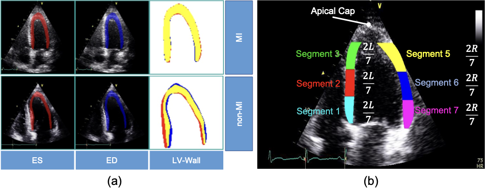
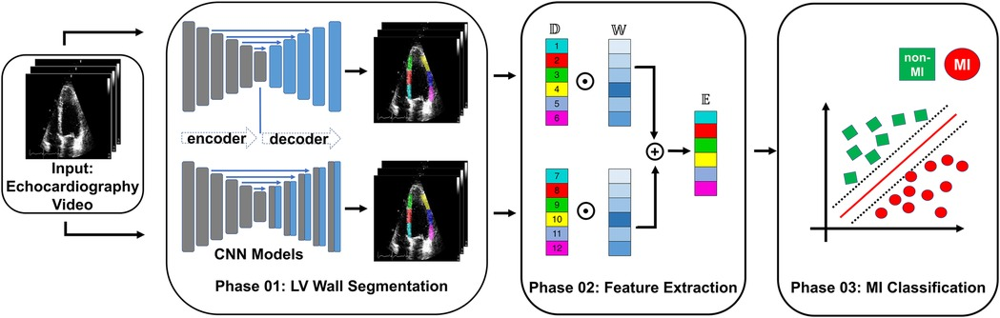

## Repository

GitHub repository: [ou-jiajian/mi-detection-echo](https://github.com/ou-jiajian/mi-detection-echo)

## Quick Start

### Environment Setup

1. **Create conda environment**
```bash
conda env create -n mi_echo_py37 -f environment.yml
```

2. **Activate environment**
```bash
conda activate mi_echo_py37
```

3. **Install additional dependencies**
```bash
pip install segmentation-models-pytorch==0.2.0 scikit-learn==0.24.2 wandb==0.13.11
```

### Data Preparation

Configure data path environment variables:
```bash
export MI_IMAGE_FOLDER="/path/to/your/images_jpg"           # Original images directory
export MI_MASK_FOLDER="/path/to/your/mask_jpg"              # Masks directory  
export MI_FN_CSV="/path/to/your/HMC_QU_adjusted.csv"        # CSV annotation file
export MI_ENCODER_WEIGHTS="none"                            # or "imagenet"
export WANDB_MODE=offline                                   # Offline mode
export PYTHONPATH="$PWD:$PYTHONPATH"                        # Add project path
```

**Data format requirements**:
- Images: `images_jpg/{case_ID}/frame_XXXX.jpg`
- Masks: `mask_jpg/Mask_{case_ID}/frame_XXXX.jpg` or `.dat` format
- CSV: Contains `fn,s1,s2,s3,s4,s5,s6,mask_available,nframe` columns

### Model Training

**Method 1: Use original training script (recommended)**
```bash
python run_original_train.py
```

**Method 2: Use simplified training script**
```bash
python simple_train.py
```

**Method 3: Custom training parameters**
```python
from easydict import EasyDict
from segmentation.segmentation_trainer import run_n_epochs

config = EasyDict(dict(
    architecture='Unet',        # Unet, UnetPlusPlus, Linknet, FPN, PAN, DeepLabV3
    encoder='resnet18',         # resnet18, resnet34, mobilenet_v2, efficientnet-b0
    epoch=5,                    # Training epochs
    fold=0,                     # Cross-validation fold (0-4)
    batch_size=8,               # Batch size
    img_shape=(224, 224),       # Image size
))

run_n_epochs(config)
```

### Model Validation

Check trained models:
```bash
python check_model.py
```

### Training Results

After training, model files are saved in:
- `models/segment_ckpt_5folds/` - Original training results
- `models/simple_train/` - Simplified training results

**Performance metrics** (example):
- Final test IoU: **84.53%**
- Model size: 54.8MB
- Parameters: 14.3M

## Myocardial Infarction Detection in Echocardiography


- (A) Segmentation mask of the LV wall for both an end-systolic frame and an end-diastolic frame, with one case representing an MI and the other case representing a non-MI case in the HCM-QU dataset. 
- (B) Six segments of the LV wall may be used to detect signs of an MI. The label “L” represents the length from the bottom left corner to the apex of the LV, and the label “R” represents the length from the bottom right corner to the apex of the LV.


## Overview of framework


 Overview of the proposed MI detection framework. 
- In the phase 01 block, blue blocks represent convolutional layers, gray blocks represent transposed convolutional layers, and blue arrows represent the skip connections between the encoder and decoder.
- In the phase 02 block, 𝔻 refers to the displacement of the heart muscle during a cardiac event, 𝕎 refers to the weight assigned to different features within the ensemble model used for detection, and 𝔼 refers to the ensemble of features used to identify MI.

Please cite the paper, as below, when using this repository:
```
@article{nguyen2023ensemble,
  title={Ensemble learning of myocardial displacements for myocardial infarction detection in echocardiography},
  author={Nguyen, Tuan and Nguyen, Phi and Tran, Dai and Pham, Hung and Nguyen, Quang and Le, Thanh and Van, Hanh and Do, Bach and Tran, Phuong and Le, Vinh and others},
  journal={Frontiers in Cardiovascular Medicine},
  volume={10},
  year={2023},
  publisher={Frontiers Media SA}
}
```

## Model Inference Usage

Load trained model for inference:
```python
import torch
from segmentation.segmentation_utils import get_model_and_optim
from easydict import EasyDict

# Configuration
config = EasyDict(dict(
    architecture='Unet',
    encoder='resnet18',
    img_shape=(224, 224),
))

# Load model
device = torch.device('cpu')
model, _ = get_model_and_optim(config, device=device)
model.load_state_dict(torch.load('models/segment_ckpt_5folds/best_model.pth', map_location=device))
model.eval()

# Inference
with torch.no_grad():
    output = torch.sigmoid(model(input_tensor))  # input_tensor: [1, 3, 224, 224]
    prediction = (output > 0.5).cpu().numpy()   # Binary mask
```

## Troubleshooting

**Common Issues**:

1. **ModuleNotFoundError: No module named 'datasets'**
   ```bash
   export PYTHONPATH="$PWD:$PYTHONPATH"
   ```

2. **wandb network connection timeout**
   ```bash
   export WANDB_MODE=offline
   ```

3. **CUDA out of memory**
   - Reduce `batch_size`
   - Set `MI_ENCODER_WEIGHTS="none"` to use CPU

4. **Data path mismatch**
   - Check if environment variables are set correctly
   - Ensure data directory structure meets requirements

## Project Structure

```
mi-detection-echo/
├── datasets/                 # Data loaders
├── segmentation/             # Segmentation models and training
├── mi/                       # MI detection related
├── utils/                    # Utility functions
├── models/                   # Trained models
├── run_original_train.py     # Original training script
├── simple_train.py          # Simplified training script
├── check_model.py           # Model validation script
└── environment.yml          # Environment configuration
```

## Notes
- This English `README.en.md` is a copy of the main documentation.
- Chinese version: `README.md`.
- Project has been fully adapted to support multiple data formats and training modes.

