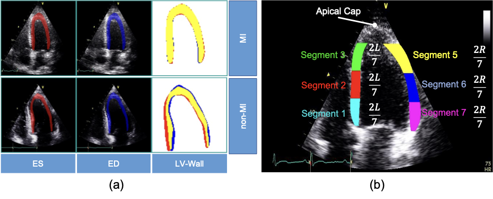
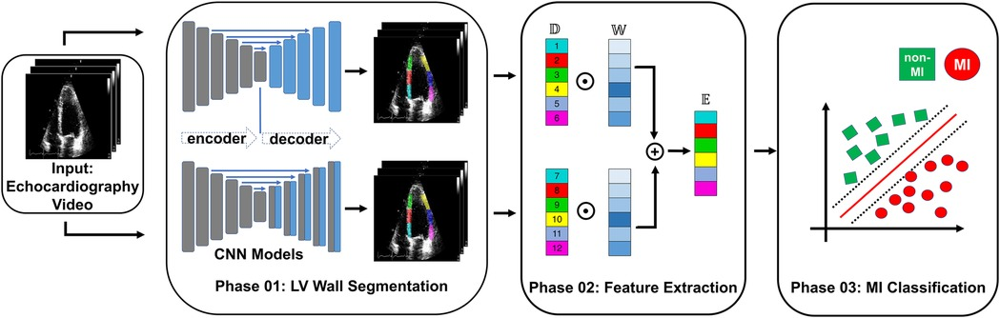

## 仓库信息

本项目的 GitHub 仓库： [ou-jiajian/mi-detection-echo](https://github.com/ou-jiajian/mi-detection-echo)

## 快速开始

### 环境配置

1. **创建 conda 环境**
```bash
conda env create -n mi_echo_py37 -f environment.yml
```

2. **激活环境**
```bash
conda activate mi_echo_py37
```

3. **安装额外依赖**
```bash
pip install segmentation-models-pytorch==0.2.0 scikit-learn==0.24.2 wandb==0.13.11
```

### 数据准备

配置数据路径环境变量：
```bash
export MI_IMAGE_FOLDER="/path/to/your/images_jpg"           # 原始图像目录
export MI_MASK_FOLDER="/path/to/your/mask_jpg"              # 掩码目录  
export MI_FN_CSV="/path/to/your/HMC_QU_adjusted.csv"        # CSV标注文件
export MI_ENCODER_WEIGHTS="none"                            # 或 "imagenet"
export WANDB_MODE=offline                                   # 离线模式
export PYTHONPATH="$PWD:$PYTHONPATH"                        # 添加项目路径
```

**数据格式要求**：
- 图像：`images_jpg/{病例ID}/frame_XXXX.jpg`
- 掩码：`mask_jpg/Mask_{病例ID}/frame_XXXX.jpg` 或 `.dat` 格式
- CSV：包含 `fn,s1,s2,s3,s4,s5,s6,mask_available,nframe` 列

### 模型训练

**方法1：使用原版训练脚本（推荐）**
```bash
python run_original_train.py
```

**方法2：使用简化训练脚本**
```bash
python simple_train.py
```

**方法3：自定义训练参数**
```python
from easydict import EasyDict
from segmentation.segmentation_trainer import run_n_epochs

config = EasyDict(dict(
    architecture='Unet',        # Unet, UnetPlusPlus, Linknet, FPN, PAN, DeepLabV3
    encoder='resnet18',         # resnet18, resnet34, mobilenet_v2, efficientnet-b0
    epoch=5,                    # 训练轮数
    fold=0,                     # 交叉验证折数 (0-4)
    batch_size=8,               # 批大小
    img_shape=(224, 224),       # 图像尺寸
))

run_n_epochs(config)
```

### 模型验证

检查训练好的模型：
```bash
python check_model.py
```

### 训练结果

训练完成后，模型文件保存在：
- `models/segment_ckpt_5folds/` - 原版训练结果
- `models/simple_train/` - 简化训练结果

**性能指标**（示例）：
- 最终测试 IoU: **84.53%**
- 模型大小: 54.8MB
- 参数量: 14.3M

## 基于超声心动图的心肌梗死检测


- (A) HCM-QU 数据集中的两帧（收缩末期与舒张末期）左心室（LV）心肌分割示意，分别对应 MI 与非 MI 个案。
- (B) LV 壁被划分为 6 个分区用于 MI 迹象检测。标记 “L” 表示从左下角至心尖的长度，标记 “R” 表示从右下角至心尖的长度。

## 框架总览


基于两阶段的 MI 检测框架：
- Phase 01：编码器-解码器结构进行分割与表征（蓝色为卷积层，灰色为反卷积层，蓝色箭头为跳连）。
- Phase 02：利用心肌位移 𝔻、特征权重 𝕎 与特征集 𝔼 的集成策略进行 MI 判别。

## 引用
如使用本仓库，请引用如下论文：
```
@article{nguyen2023ensemble,
  title={Ensemble learning of myocardial displacements for myocardial infarction detection in echocardiography},
  author={Nguyen, Tuan and Nguyen, Phi and Tran, Dai and Pham, Hung and Nguyen, Quang and Le, Thanh and Van, Hanh and Do, Bach and Tran, Phuong and Le, Vinh and others},
  journal={Frontiers in Cardiovascular Medicine},
  volume={10},
  year={2023},
  publisher={Frontiers Media SA}
}
```

## 模型推理使用

加载训练好的模型进行推理：
```python
import torch
from segmentation.segmentation_utils import get_model_and_optim
from easydict import EasyDict

# 配置
config = EasyDict(dict(
    architecture='Unet',
    encoder='resnet18',
    img_shape=(224, 224),
))

# 加载模型
device = torch.device('cpu')
model, _ = get_model_and_optim(config, device=device)
model.load_state_dict(torch.load('models/segment_ckpt_5folds/best_model.pth', map_location=device))
model.eval()

# 推理
with torch.no_grad():
    output = torch.sigmoid(model(input_tensor))  # input_tensor: [1, 3, 224, 224]
    prediction = (output > 0.5).cpu().numpy()   # 二值化掩码
```

## 故障排除

**常见问题**：

1. **ModuleNotFoundError: No module named 'datasets'**
   ```bash
   export PYTHONPATH="$PWD:$PYTHONPATH"
   ```

2. **wandb网络连接超时**
   ```bash
   export WANDB_MODE=offline
   ```

3. **CUDA内存不足**
   - 减小 `batch_size`
   - 设置 `MI_ENCODER_WEIGHTS="none"` 使用CPU

4. **数据路径不匹配**
   - 检查环境变量是否正确设置
   - 确认数据目录结构符合要求

## 项目结构

```
mi-detection-echo/
├── datasets/                 # 数据加载器
├── segmentation/             # 分割模型和训练
├── mi/                       # MI检测相关
├── utils/                    # 工具函数
├── models/                   # 训练好的模型
├── run_original_train.py     # 原版训练脚本
├── simple_train.py          # 简化训练脚本
├── check_model.py           # 模型验证脚本
└── environment.yml          # 环境配置
```

## 说明
- 本中文 `README.md` 为项目主要说明文档。
- 英文副本请见 `README.en.md`。
- 项目已完成适配，支持多种数据格式和训练模式。